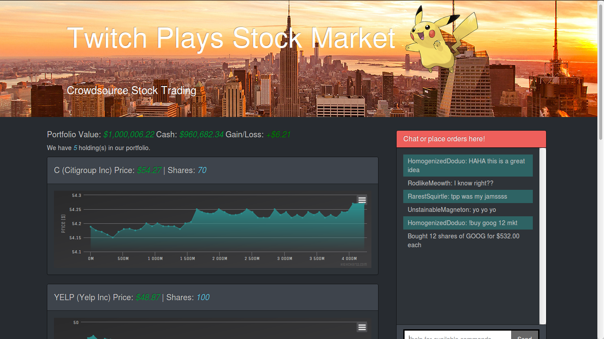

# FinTechHack2015
### Inspired by Twitch Plays Pokemon


# Setup Instructions
* In top directory, run node server.js
* Go to localhost:3000

# Misc
The frontend expects the server to pass JSON object with the following structure in order to update:

```javascript
{
    cash: 0,
    initialValue: 0,
    portfolioValue: 0,
    holdings: [
        {
            ticker: "TSLA", // ticker symbol
            name: "Tesla Motors Inc", // display name
            price: [232.95, 233.45, 233.04, 232.62, 232.87, ...], // array of historical prices
            quantity: 1200 // shares held
        },
        {
            ticker: "DIS",
            name: "Walt Disney Co",
            price: [110.81, 110.25, 111.07, 110.66, ...],
            quantity: 500
        },
        ...
    ]
}
```
